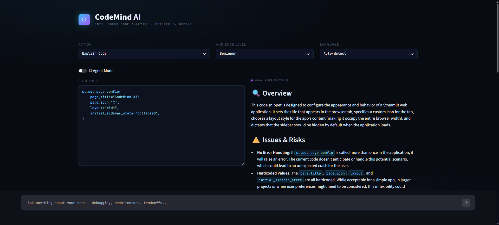
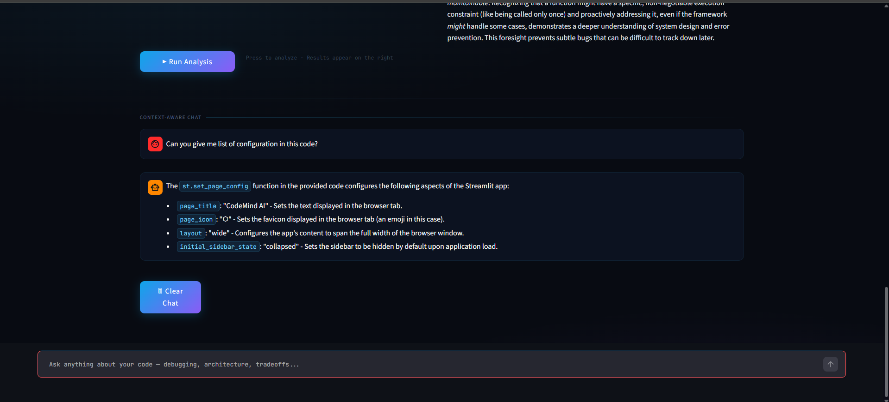

# 🧠 CodeMind AI – AI Developer Assistant

An AI-powered developer tool designed to **analyze, debug, and optimize code** using modern LLM capabilities.  
Built with a focus on **Developer Experience (DX)**, this project goes beyond a basic wrapper and introduces **agentic behavior, structured reasoning, and conversational memory**.

---

## 🚀 Features

### 🔍 Code Analysis
- Explain code in simple or advanced terms  
- Detect bugs and inefficiencies  
- Suggest improvements and optimizations  

### 🧠 Agent Mode (Multi-Step Reasoning)
- Iteratively improves code  
- Simulates real developer workflow  
- Provides explanation of changes  

### 💬 Chat Mode (Context-Aware)
- Maintains conversation history  
- Understands previous analysis  
- Helps with debugging, concepts, and improvements  

### ⚡ AI Powered
- Integrated with **Google Gemini API**  
- Fast and efficient responses  
- Optimized for developer use cases  

---

## 🧠 What Makes This Different?

Unlike basic AI wrappers, this project:

- Uses **structured step-by-step reasoning**
- Maintains **context between analysis and chat**
- Implements **agent-like iterative improvement**
- Focuses on **real developer workflows**

---

## 🛠️ Tech Stack

- Python  
- Streamlit  
- Google Gemini API  
- python-dotenv  

---

## List Of Gemini Models You Can Use

- gemini-2.0-flash  
- gemini-2.0-flash-lite  
- gemini-2.5-pro  
- gemini-2.5-flash 
---

## 📸 Screenshots

### 🔹 Landing Image


### 🔹 Analysis Mode


### 🔹 Chat Mode


---

## ▶️ How to Run Locally

### 1. Clone the Repository

```bash
git clone https://github.com/your-username/CodeMind-AI.git
cd CodeMind-AI
```
### 2. Install Dependencies
```bash
pip install -r requirements.txt
```
### 3. Setup .ENV file
```bash
GOOGLE_API_KEY = your_gemini_api_key_here
```
### 4. Run The Application
```bash
streamlit run app.py
```
## 🔐 Note

- Make sure your `.env` file is not pushed to GitHub  
- API keys should always remain private  

---

## 🎯 Future Improvements

- 🔧 Code execution agent (run + fix + re-evaluate)  
- 🧠 Persistent memory across sessions  
- 📂 Multi-file code support  
- 🔌 IDE integrations (VS Code extension)  

---

## 🤝 Contributing

Contributions are welcome!  
Feel free to open issues or submit pull requests.
## 📬 Contact

If you’d like to collaborate or discuss Developer Relations opportunities, feel free to connect:

- LinkedIn: https://linkedin.com/in/kathank  
- GitHub: https://github.com/kathankraithatha  
- Email: kathankraithatha@gmail.com  